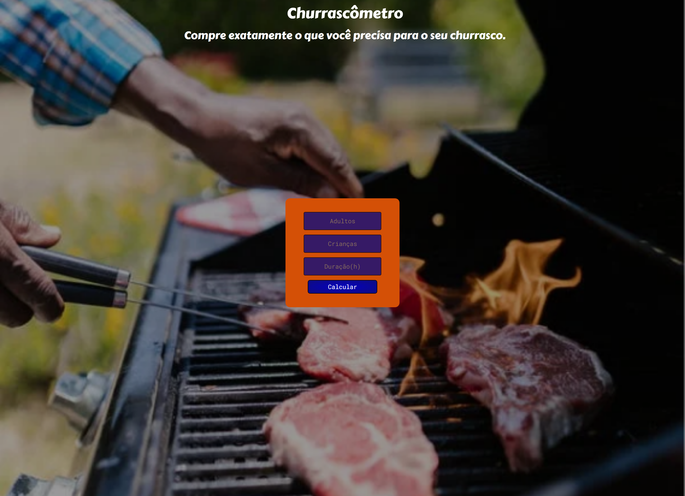

# Churrascômetro
Projeto de uma calculadora para churrasco fornecendo a quantidade de comida e bebida necessária/ Project of a calculator for steak that gives the amount of drinks and meat necessary

> Aprendizados
 Desenvolvi ainda mais a minha familiaridade com o CSS, trazendo mais facilidade com essa ferramenta o que me permitiu ser mais criativa e criar o projeto exatamente igual ao design do projeto inicial.
 Criei um pequeno delay para realizar a função de calcular, usando também as famosas arrow functions
 Em suma, esse exercício  rápido foi fundamental para praticar o aprendido com Javascript, fiquei extremamente realizada com o resultado.

 [Clique aqui para acessar](https://playerszone.github.io/nlw-esports-explorer/)

##  ⚙️ Tecnologias

- HTML5
- CSS3
- Javascript
- Git e Github

## 📞 Contato

 email: playerszone.contato@gmail.com
